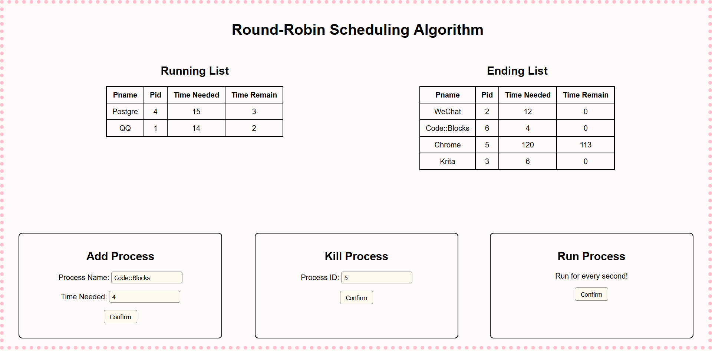

# Round-Robin Scheduling Algorithm Visualizer

[](rr.html)

## Design

* `State` field in PCB is redundant because:
  - Processes in state R are all in Running List
  - Processes in state E are all in Ending List
* The circular queue can be replaced by a circular linked list because:
  - A queue can be implemented by a linked list
  - Linked lists additionally support insert operation at a designated position, thus a newly inserted process can be run at once
* A circular linked list can be repalced by a single linked list because:
  - They provide the same access and modify operations
  - When iterating the single linked list, if the iterator reaches the end of the list, we can changed it to the front of the list to provide the same iteration behaviour as a circular linked list
* The fields `Time Needed` and `Time Elapsed` can be replaced by `Time Needed` and `Time Remain` because:
  - There is a simple relationship between them -- `Time Needed` = `Time Elapsed` + `Time Remain`
  - If we use `Time Remain`, we can easily know whether a process is ended by checking `Time Remain` = 0

## Features

* Use C++17 standard
* Use `std::forward_list` in STL as the circular queue
* Compile C++ to JavaScript to render UI in browser
* Add a kill process option

## Source Files

* `src/main.cpp`  -- PCB and its operations
* `index.html`  -- Web page for visualization
* `rr.css`  -- Stylesheet for HTML
* `rr.js` -- JavaScript code to operate and display PCB

## Build

Prerequisite: [Emscripten](http://emscripten.org/)

``` sh
$ em++ -Wall -Werror -std=c++17 -O --bind -o main.js src/main.cpp
```

## References

* https://stackoverflow.com/a/19375586
* http://kripken.github.io/emscripten-site/docs/porting/connecting_cpp_and_javascript/embind.html
